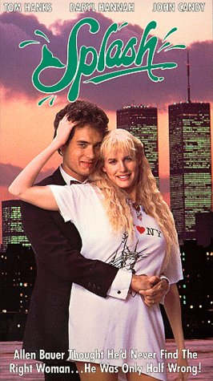
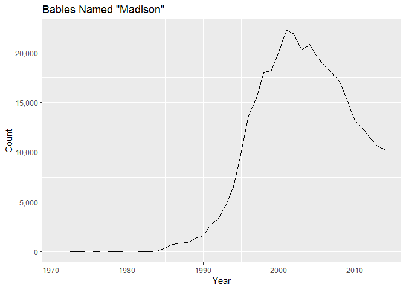
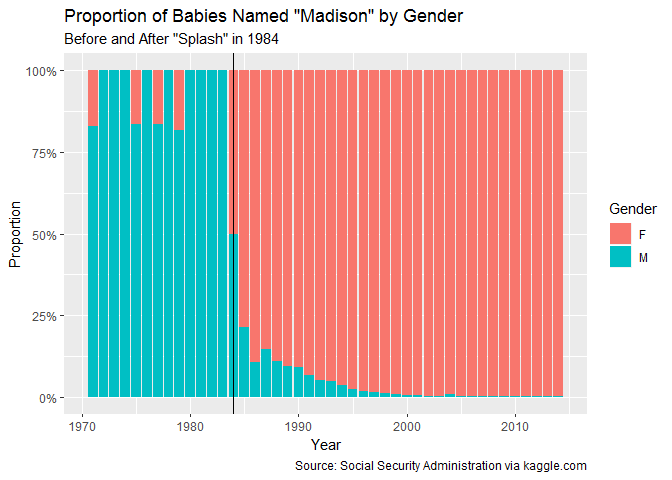
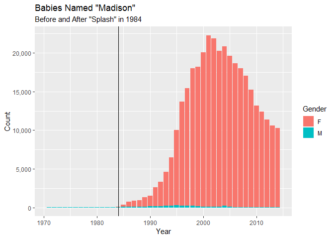

 What impact di the 1984 movie "Splash" have
on baby names?

Load National Social Security Database. source: Kaggle

    library(tidyverse)
    baby_names<-read_csv("data/NationalNames.csv")

    baby_names %>% 
      filter(Name=="Madison",Year>1970) %>% 
      group_by(Year) %>% 
      summarise(Count=sum(Count)) %>% 
      ggplot(aes(Year,Count))+geom_line()+
      scale_y_continuous(labels = scales::comma) +
      labs(title='Babies Named "Madison"')

    ## Warning: package 'bindrcpp' was built under R version 3.4.4

    baby_names %>% 
      filter(Name=="Madison",Year>1970) %>% 
      select(Year,Gender,Count) %>% 
    #  spread(Gender,Count) %>% 
    #  mutate(F=replace_na(F,0)) %>% 
      ggplot(aes(Year,Count,fill=Gender))+geom_col(position = "fill")+
      geom_vline(xintercept = 1984) +
      scale_y_continuous(labels = scales::percent) +
      labs(title='Proportion of Babies Named "Madison" by Gender',
           y="Proportion",
           subtitle = 'Before and After "Splash" in 1984')

    baby_names %>% 
      filter(Name=="Madison",Year>1970) %>% 
      group_by(Year) %>% 
      # summarise(Count=sum(Count)) %>% 
      ggplot(aes(Year,Count,fill=Gender))+geom_col()+
      geom_vline(xintercept = 1984) +
      scale_y_continuous(labels = scales::comma) +
      labs(title='Babies Named "Madison"',
           subtitle = 'Before and After "Splash" in 1984')

